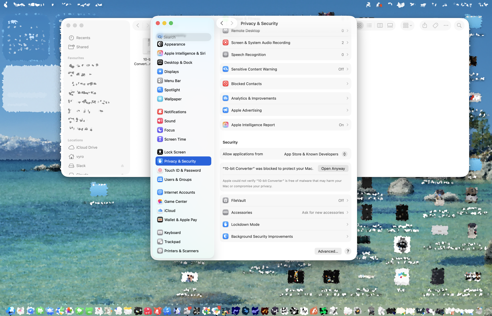
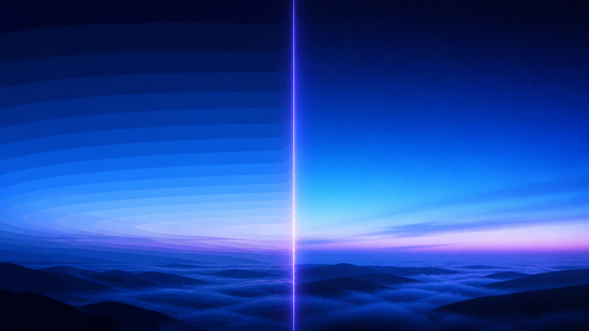
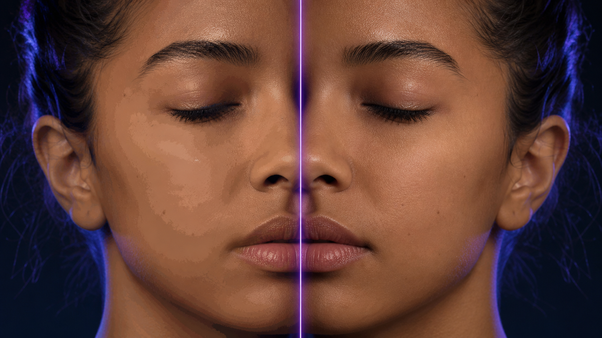
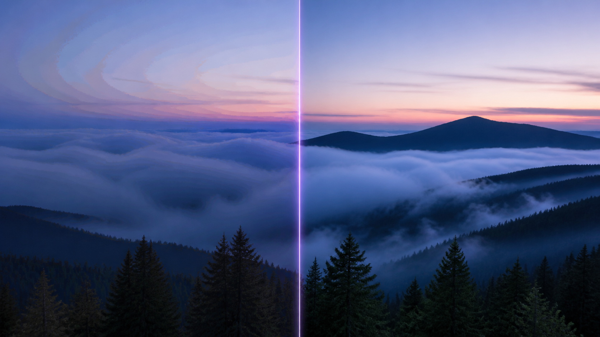
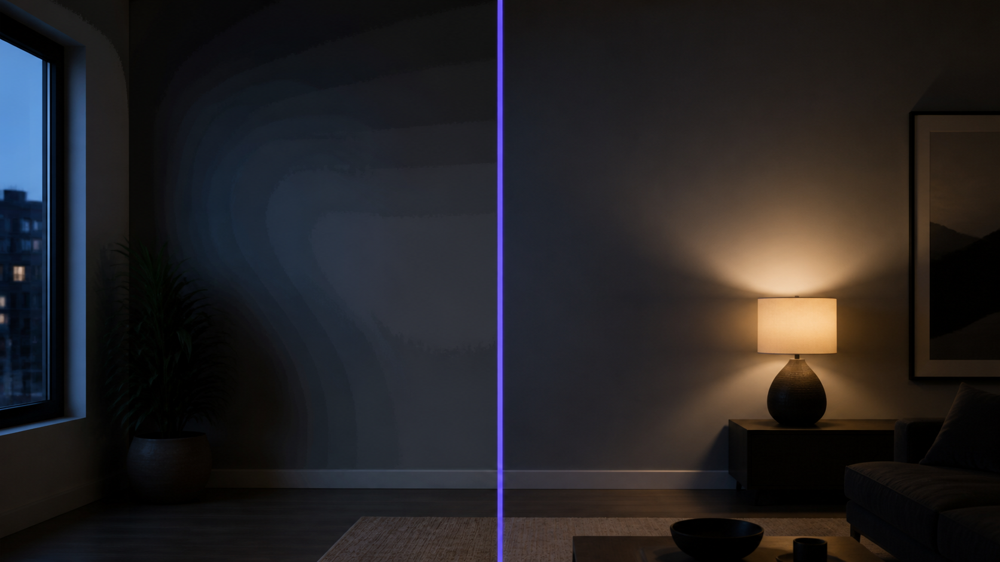
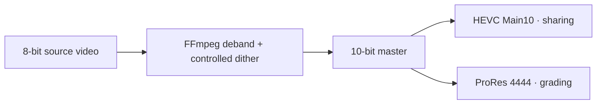
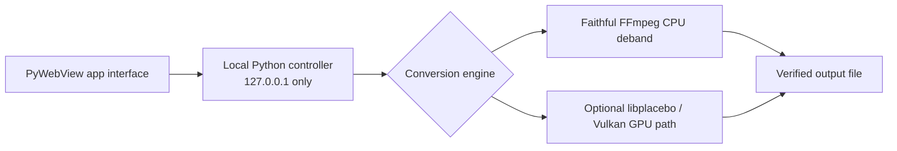

# 10-bit Converter

  

> A local macOS finishing tool that makes fragile 8-bit gradients easier to
> live with in post.

8-bit footage can look completely fine until a sky, wall, fog layer, shadow,
or skin-tone rolloff starts showing visible steps. 10-bit Converter applies a
careful deband + dither pass, then writes a true 10-bit master for delivery or
the grade still ahead.

**[Download the Mac release](https://github.com/JazibAli360/10-bit-converter/releases/latest)** · **[Watch the product film](https://jazibali360.github.io/10-bit-converter/)** · **[Open an issue](https://github.com/JazibAli360/10-bit-converter/issues)**

## Start here

### What it does

- Reduces the *visibility* of gradient banding / false contouring.
- Adds controlled dither so smooth tonal transitions read more naturally.
- Exports HEVC Main10 for compact delivery or ProRes 4444 for a grading master.
- Runs locally: no accounts, uploads, cloud rendering, or analytics.

### What it does not do

It does not recover colour values, dynamic range, texture, or detail that was
never in the 8-bit source. It is a practical finishing step—not a black-box
restoration model or a magic “make it cinematic” button.

### Before you download

The current release is **macOS / Apple Silicon (`arm64`) only**. It is open
source but not yet signed or notarized by Apple, so macOS may block the first
launch.

1. Try opening **10-bit Converter** once.
2. Go to **System Settings → Privacy & Security**.
3. Select **Open Anyway** next to the 10-bit Converter notice, then confirm
   **Open**. This is a one-time step.

## Choose the right export

| Export | Use it when | Keep in mind |
| --- | --- | --- |
| **HEVC Main10** (`.mp4`) | You need a smaller 10-bit file for sharing, review, or delivery. | Playback support still depends on the recipient’s player and hardware. |
| **ProRes 4444** (`.mov`) | You are taking the clip into a grade, edit, or VFX workflow. | It is a robust 10-bit 4:4:4 intermediate, and the files are very large. |

### Optional: AI Footage Colour-Safe

This opt-in profile is for clips where synthetic skies, skin rolloffs, fog, or
dark gradients still look delicate after a normal deband pass. It works in a
high-precision 4:4:4 intermediate, treats chroma more gently than luma, uses
a stable dither pattern, and error-diffuses the final 10-bit reduction. It is
slower than the default **Faithful 10-bit** profile.

It still does not invent missing colour values or texture. Leave **Source
intent** on *Preserve tags / appearance* unless you know the clip is Rec.709
limited-range or sRGB full-range; those choices only tell the export how to
label known SDR material.

## What problem it solves

Banding is the visible staircase in a gradient that should feel continuous.
An 8-bit channel has **256 values**; a 10-bit channel has **1,024**. More
tonal steps do not resurrect lost source data, but they give the cleanup and
the next stage of post more room to behave.

*Original project illustration. It explains the cleanup goal; it is not a
measured output test.*

| Visible 8-bit-style banding | Debanded + dithered 10-bit master |
| --- | --- |
|  |  |
| Smooth skies and shadows can break into obvious steps. | Fine dither breaks up harsh contours so transitions read more naturally. |

### Where creators tend to notice it

| Skin-tone rolloff | Fog and atmosphere | Shadows and interiors |
| --- | --- | --- |
|  |  |  |
| Soft cheek, temple, and key-light transitions can expose posterization. | Large low-texture gradients make contour lines easy to see. | Lifted blacks and compressed dark areas can turn a rolloff into stripes. |

*These are original photorealistic illustrative use cases generated for this
project—not measured output tests or claims about specific real footage.*

Reference visual: [UniFab — Color Banding in Video](https://unifab.ai/resource/what-is-color-banding). Bit-depth context: [Dare Dreamer](https://daredreamer.com/understanding-8bit-vs-10bit/) and [Deep Image Debanding](https://arxiv.org/pdf/2110.08569). See the [full source ledger](docs/SOURCES.md).

## Tested result

| Test machine | Unified memory | Source → export | Output | Observed speed |
| --- | --- | --- | --- | --- |
| Apple M3 MacBook | 18 GB | 15-second clip → 30-second export | ProRes 4444 | ≈0.5× real time |

This is one observed release test, included to set expectations—not a
performance guarantee. Source resolution/codec, settings, destination storage,
system load, and the selected engine all affect export time.

## Privacy, plainly

Your footage stays on your Mac. The app processes only the files you choose.
The interface talks to a local Python controller on `127.0.0.1`, which runs
the bundled FFmpeg tools on your machine. There are no accounts, telemetry,
uploads, or cloud-rendering path in the app.

The only optional network activity is update metadata: once every seven days,
the app asks GitHub Releases whether a newer public version exists. It sends no
footage or account data, never downloads or installs an update automatically,
and always leaves the decision to you.

Every export also carries the standard file comment **“Processed with 10-bit
Converter by Jazib Ali 360”**. The app preserves the source metadata map, but
this intentionally replaces any pre-existing `comment` field with a clear
processing note.

## For the curious: how it works

The CPU engine is the default release path. The optional GPU path is
experimental and appears only after its local capability check passes.

### Common questions

**Does it create real 10-bit video?** Yes. It writes 10-bit HEVC Main10 or
10-bit 4:4:4 ProRes output. It does not recreate tones missing from the
original 8-bit clip.

**Why is my file huge?** ProRes 4444 is built for a robust grading
intermediate, not compact delivery. Choose HEVC Main10 when size matters.

**Why is it slow?** Debanding, dithering, high-quality processing, two-pass
delivery, and ProRes all cost time. Clip length, resolution, storage, and
hardware matter too.

**Will it fix every clip?** No. Severe compression, pre-existing
posterization, aggressive grades, and later platform re-encoding can still
show banding. Start with the gentlest setting that solves the visible issue.

## Open source: fork it, improve it, tell me what breaks

The most useful support is real feedback: a troublesome gradient, a workflow
the app should handle better, or a hardware note that helps the next creator.
Open a [GitHub Issue](https://github.com/JazibAli360/10-bit-converter/issues)
with the app version, macOS version, input codec/resolution, chosen export
profile, and relevant error text. Please do not upload private footage or
credentials.

- Start a fork with [AGENTS.md](AGENTS.md), the [brand guide](docs/BRAND.md),
  and the [product story](docs/PRODUCT_STORY.md).
- Read the [Code of Conduct](CODE_OF_CONDUCT.md) before participating.
- Security reports have their own guidance in [SECURITY.md](SECURITY.md). Do
  not post sensitive details in a public issue.

### Windows is an open invitation

I do not currently have access to a Windows machine, so the Windows build is
incomplete and there is no validated Windows release. If you do have one,
please feel free to build it, test it, improve it, or take it further. Start
with the [Windows build notes](.windows/README.md) or hand the copy-ready
[agent brief](.windows/AGENT_BUILD.md) to an AI coding agent on Windows x64.

## Technical notes

Built with Python, PyWebView, HTML/CSS/JavaScript, FFmpeg/FFprobe, `libx265`,
ProRes 4444 output, and optional libplacebo/Vulkan. Core conversion behaviour
has regression tests; the repository deliberately excludes `.app` bundles,
FFmpeg binaries, test videos, and other large local artifacts. Follow the
relevant FFmpeg licensing when making a standalone build.

## License

Released under the [MIT License](LICENSE). Use it, change it, learn from it,
ship it inside another project, or make something much better with it—just
keep the license notice with substantial copies.

---

Built quickly with agent-assisted development, then tested as a real local
tool. Please review it for your own production use, report anything odd, and
send improvements back if you feel like it.
